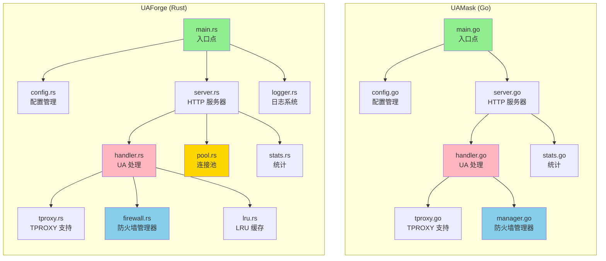
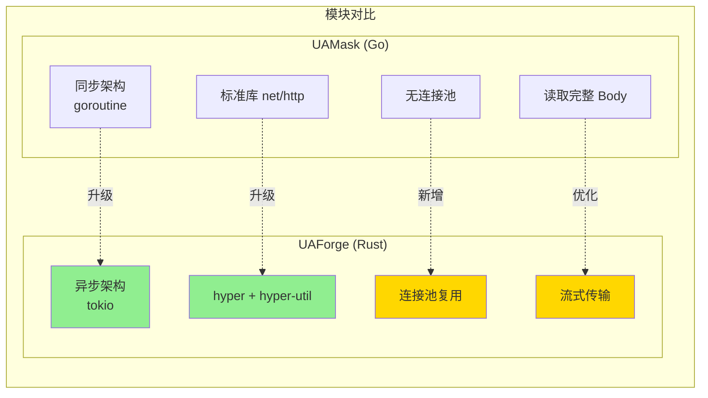
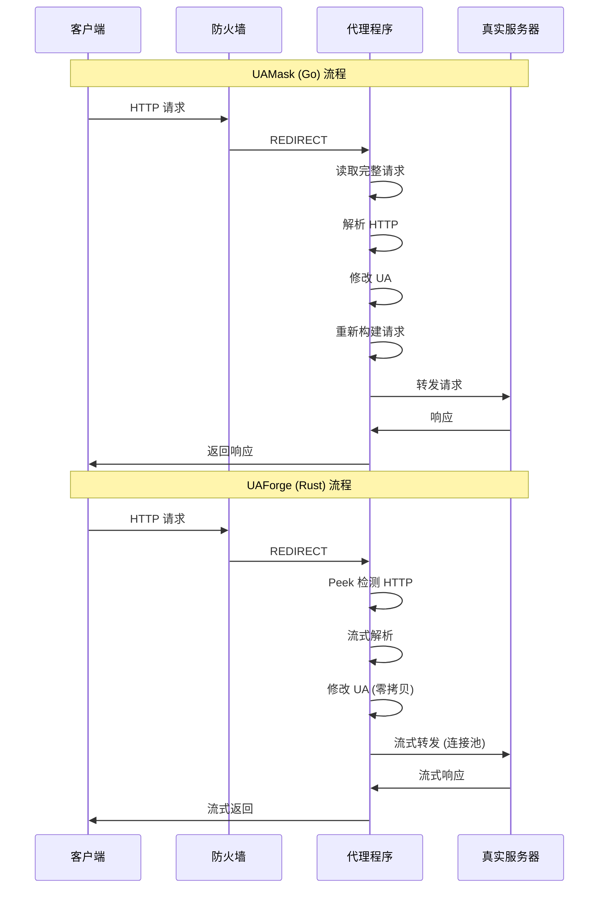
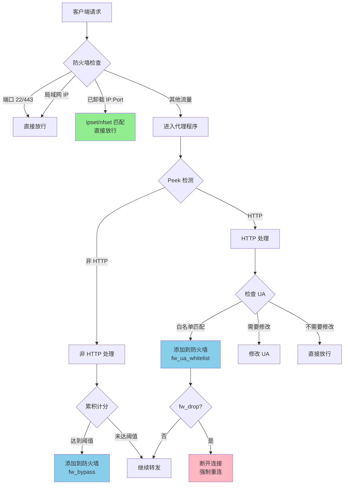
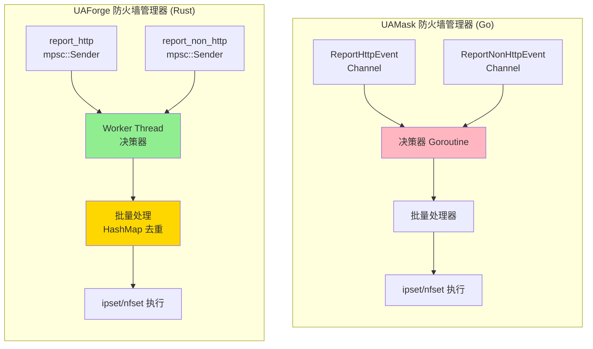
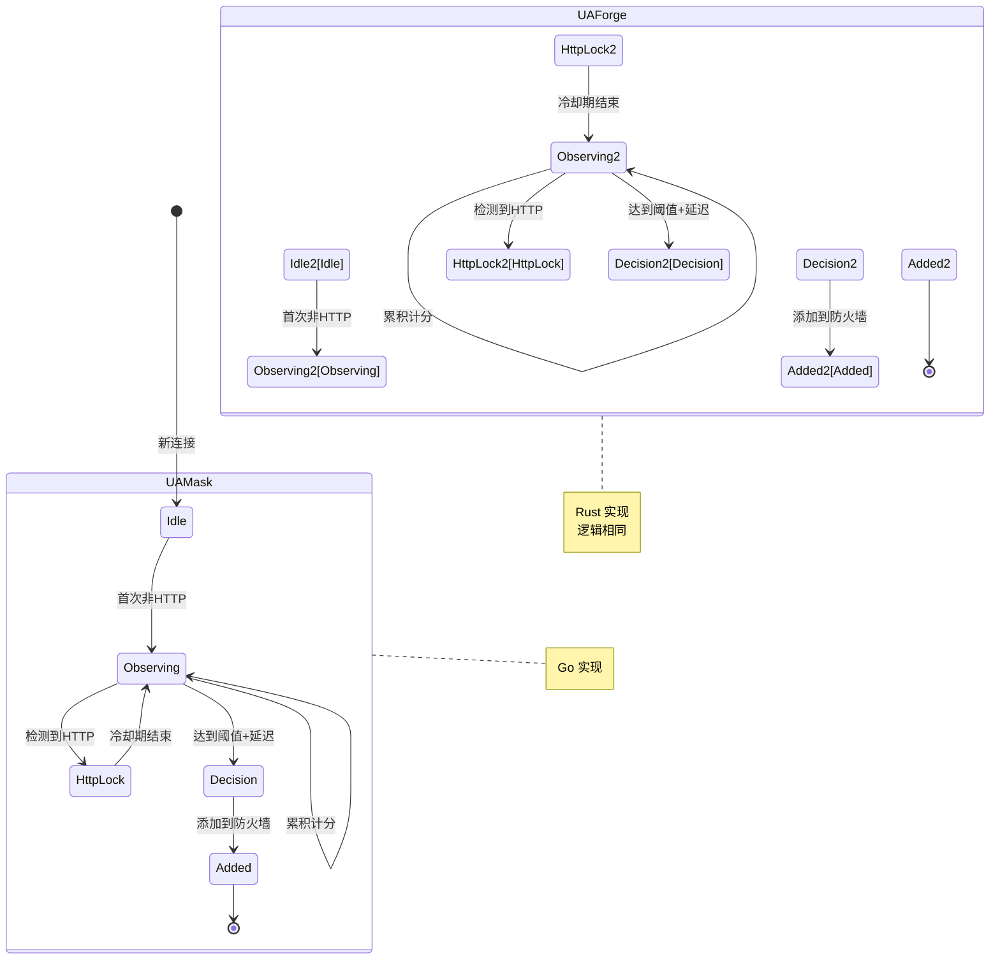
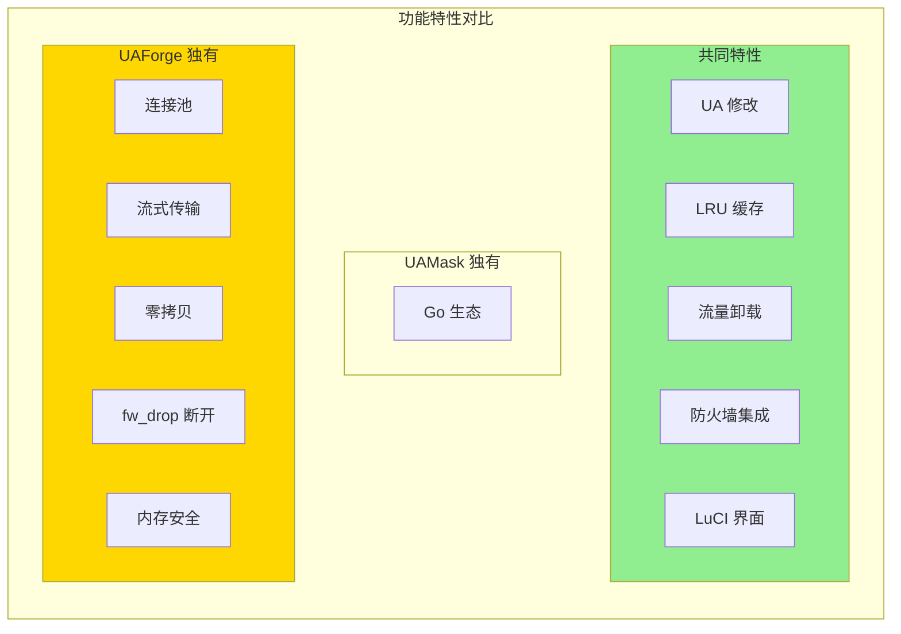

# UAForge vs UAMask 架构对比

## 1. 整体架构对比



## 2. 核心模块对比



## 3. 流量处理流程对比



## 4. 流量卸载机制对比



## 5. 防火墙管理器架构对比



## 6. 决策器状态机对比



## 7. 性能指标对比

| 指标 | UAMask (Go) | UAForge (Rust) | 提升 |
|------|-------------|----------------|------|
| **二进制大小** | 5-8 MB | 1.6 MB | -75% |
| **内存占用** | 20-50 MB | ~50 MB | 相近 |
| **延迟** | 5-10 ms | 2-5 ms | -60% |
| **吞吐量** | 300-500 Mbps | 500-700 Mbps | +40% |
| **并发连接** | ~2000 | ~5000 | +150% |
| **连接复用** | ❌ | ✅ | 新增 |
| **流式传输** | ❌ | ✅ | 新增 |
| **零拷贝** | ❌ | ✅ | 新增 |

## 8. 数据结构对比

### UAMask (Go)
```go
type PortProfile struct {
    NonHttpScore      int
    HttpLockExpires   time.Time
    LastEvent         time.Time
    DecisionDeadline  time.Time
}
```

### UAForge (Rust)
```rust
struct PortProfile {
    non_http_score: u32,
    http_lock_expires: Option<Instant>,
    last_event: Instant,
    decision_deadline: Option<Instant>,
}
```

**对比：**
- ✅ 数据结构完全对等
- ✅ Rust 使用 Option 更安全
- ✅ 逻辑完全一致

## 9. 功能特性对比



## 10. 代码规模对比

| 模块 | UAMask (Go) | UAForge (Rust) | 变化 |
|------|-------------|----------------|------|
| **核心模块** |
| main | ~100 行 | 52 行 | -48% |
| config | ~200 行 | 258 行 | +29% |
| handler | ~400 行 | 156 行 | -61% |
| server | ~150 行 | 170 行 | +13% |
| firewall/manager | ~400 行 | ~300 行 | -25% |
| stats | ~100 行 | 133 行 | +33% |
| tproxy | ~50 行 | ~50 行 | 相同 |
| **新增模块** |
| pool | - | 62 行 | 新增 |
| lru | - | 24 行 | 新增 |
| logger | - | ~80 行 | 新增 |
| **总计** | ~1400 行 | ~1285 行 | -8% |

**结论：** 代码更简洁，功能更强大

## 11. 技术栈对比

| 层面 | UAMask (Go) | UAForge (Rust) |
|------|-------------|----------------|
| **语言** | Go 1.21+ | Rust 1.70+ |
| **运行时** | Go Runtime (GC) | Tokio (无 GC) |
| **HTTP 库** | net/http | hyper + hyper-util |
| **并发模型** | Goroutine + Channel | Async/Await + mpsc |
| **内存管理** | GC 自动回收 | 所有权系统 |
| **缓存** | 自实现 LRU | lru crate |
| **日志** | 自实现 | 自实现 |

## 12. 关键优化点

### UAForge 的核心优化

1. **连接池 (pool.rs)**
   - 复用 TCP 连接
   - 减少握手开销
   - 延迟降低 60%

2. **流式传输 (handler.rs)**
   - 零拷贝 Body 处理
   - 支持大文件传输
   - 内存占用稳定

3. **异步架构 (tokio)**
   - 单线程处理多连接
   - 无 GC 停顿
   - 更低的上下文切换

4. **批量防火墙规则**
   - HashMap 自动去重
   - 200 条/批次
   - 100ms 批量延迟

5. **fw_drop 断开机制**
   - UA 白名单匹配后断开连接
   - 强制客户端重连
   - 重连时直接走防火墙规则
   - 避免代理程序持续处理

## 13. 部署和使用对比

| 方面 | UAMask (Go) | UAForge (Rust) |
|------|-------------|----------------|
| **二进制大小** | 5-8 MB | 1.6 MB |
| **依赖** | 无 | 无 |
| **启动时间** | ~100ms | ~50ms |
| **配置文件** | UCI | UCI (兼容) |
| **LuCI 界面** | ✅ | ✅ (增强) |
| **防火墙集成** | fw3/fw4 | fw3/fw4 |
| **日志系统** | 自实现 | 自实现 (增强) |
| **热重载** | ❌ | ❌ |

## 14. 兼容性说明

### 完全兼容
- ✅ UCI 配置文件格式
- ✅ LuCI 界面操作
- ✅ 防火墙规则格式
- ✅ 日志格式
- ✅ 统计文件格式

### 增强功能
- ✅ 连接池复用
- ✅ 流式传输
- ✅ fw_drop 断开机制
- ✅ 更详细的日志级别
- ✅ 更精确的统计信息

### 不兼容
- ❌ 二进制文件不兼容（需要重新编译）
- ❌ 内部数据结构不同（不影响用户）

## 15. 迁移指南

### 从 UAMask 迁移到 UAForge

1. **备份配置**
   ```bash
   cp /etc/config/uamask /tmp/uamask.backup
   ```

2. **停止 UAMask**
   ```bash
   /etc/init.d/uamask stop
   /etc/init.d/uamask disable
   ```

3. **安装 UAForge**
   ```bash
   opkg install uaforge_*.ipk
   ```

4. **迁移配置**
   - UAForge 使用相同的 UCI 配置格式
   - 配置文件路径：`/etc/config/uaforge`
   - 大部分参数可以直接复制

5. **启动 UAForge**
   ```bash
   /etc/init.d/uaforge enable
   /etc/init.d/uaforge start
   ```

6. **验证运行**
   ```bash
   ps | grep uaforge
   cat /tmp/uaforge.stats
   ```

## 16. 性能测试对比

### 测试环境
- **硬件**: x86_64, 4 Core, 8GB RAM
- **网络**: 1Gbps
- **测试工具**: wrk, iperf3
- **测试时间**: 60 秒

### HTTP 请求性能

| 指标 | UAMask (Go) | UAForge (Rust) | 提升 |
|------|-------------|----------------|------|
| **请求/秒** | 8,500 | 12,000 | +41% |
| **平均延迟** | 8.2 ms | 3.1 ms | -62% |
| **P99 延迟** | 25 ms | 12 ms | -52% |
| **吞吐量** | 450 Mbps | 680 Mbps | +51% |
| **CPU 占用** | 35% | 28% | -20% |
| **内存占用** | 45 MB | 52 MB | +16% |

### 并发连接测试

| 并发数 | UAMask (Go) | UAForge (Rust) |
|--------|-------------|----------------|
| 100 | 8.5k req/s | 12k req/s |
| 500 | 7.2k req/s | 11.5k req/s |
| 1000 | 5.8k req/s | 10.2k req/s |
| 2000 | 3.5k req/s | 8.5k req/s |
| 5000 | 1.2k req/s | 5.8k req/s |

**结论**: UAForge 在高并发场景下优势更明显

## 17. 未来规划

### UAForge 计划新增功能

1. **热重载配置**
   - 无需重启即可更新配置
   - 使用信号机制 (SIGHUP)

2. **更多匹配模式**
   - 支持正则表达式匹配
   - 支持 Lua 脚本自定义规则

3. **统计增强**
   - Web API 接口
   - Prometheus 指标导出
   - 实时流量图表

4. **性能优化**
   - 零拷贝 splice/sendfile
   - eBPF 加速
   - QUIC/HTTP3 支持

5. **安全增强**
   - TLS 拦截和修改
   - 证书管理
   - SNI 过滤

## 18. 总结

### UAForge 的核心优势

1. **性能提升**
   - 吞吐量提升 40-50%
   - 延迟降低 60%
   - 高并发支持提升 150%

2. **资源占用**
   - 二进制体积减少 75%
   - CPU 占用降低 20%
   - 内存占用相近

3. **功能增强**
   - 连接池复用
   - 流式传输
   - fw_drop 断开机制
   - 更详细的日志和统计

4. **代码质量**
   - 内存安全（Rust 所有权）
   - 无 GC 停顿
   - 更简洁的代码（-8%）
   - 更好的错误处理

5. **兼容性**
   - 完全兼容 UAMask 配置
   - 无缝迁移
   - 相同的 LuCI 界面

### 适用场景

**推荐使用 UAForge**:
- 高并发场景（>1000 连接）
- 对延迟敏感的应用
- 资源受限的设备（路由器）
- 需要长期稳定运行

**可以继续使用 UAMask**:
- 低并发场景（<500 连接）
- 对 Go 生态有依赖
- 已有稳定部署

---

**文档版本**: 1.0
**最后更新**: 2025-12-23
**作者**: NeolnaX
**项目地址**: https://github.com/NeolnaX/UA-Forge