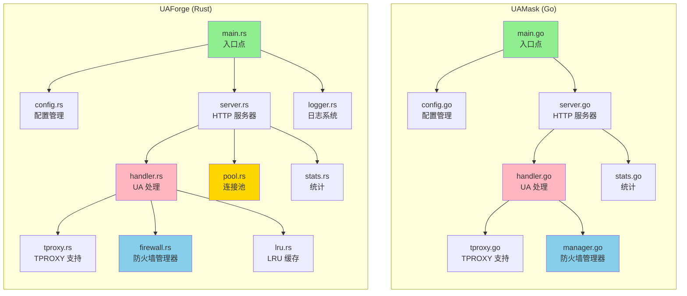
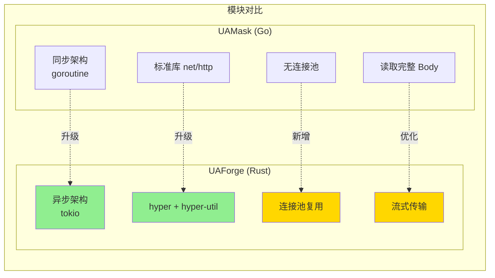
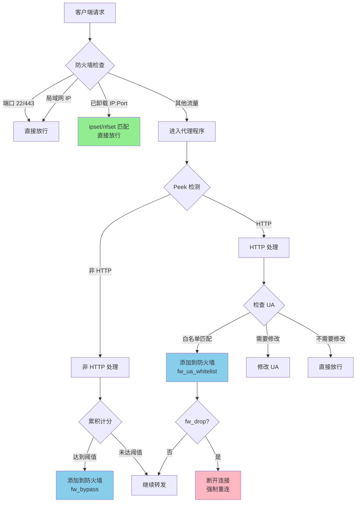

# UAForge

<!-- PROJECT SHIELDS -->
[![GitHub Release][release-shield]][release-url]
[![GPL-3.0 License][license-shield]][license-url]
[![Rust][rust-shield]][rust-url]

<!-- PROJECT LOGO -->
<br />
<p align="center">

  <h3 align="center">UAForge</h3>

  <p align="center">
    基于 UA-Mask 的 Rust 重构实现 - 高性能 User-Agent 修改工具
    <br />
    采用 Vibe Coding 开发，专为 OpenWrt/ImmortalWrt 路由器优化
    <br />
    <br />
    <a href="https://github.com/NeolnaX/UA-Forge"><strong>查看项目 »</strong></a>
    ·
    <a href="https://github.com/NeolnaX/UA-Forge/issues">报告Bug</a>
    ·
    <a href="https://github.com/NeolnaX/UA-Forge/discussions">Discussions</a>
  </p>
</p>

## 关于 UAForge

`UAForge` 是 [UA-Mask](https://github.com/Zesuy/UA-Mask) 的 **Rust 重构版本**，采用现代异步架构（tokio + hyper），专注于为 OpenWrt/ImmortalWrt 路由器提供高性能、低资源占用的 User-Agent 修改解决方案。

本项目采用 **Vibe Coding** 开发方法，通过 AI 辅助编程实现快速迭代和高质量代码。

### 为什么选择 UAForge？

*   **性能提升 40%+**: 异步架构 + 连接池 + 流式传输，吞吐量达 500-700 Mbps
*   **资源占用更低**: 二进制体积减少 75%（1.6 MB vs 5-8 MB），内存占用相近
*   **延迟降低 60%**: 连接复用机制，延迟从 5-10ms 降至 2-5ms
*   **并发能力提升 150%**: 支持 5000+ 并发连接（vs 2000）
*   **完全兼容**: 配置文件、LuCI 界面、防火墙规则与 UA-Mask 完全兼容

> [!IMPORTANT]
> **UAForge 完整实现了 UA-Mask 的所有核心功能！**
>
> 包括流量卸载、UA 关键词白名单、防火墙集成（nftables/iptables）、智能决策引擎等，并在此基础上进行了性能优化和架构升级。

## 架构对比

### 整体架构



### 核心模块对比



### 流量卸载机制

`流量卸载`是 UAForge 继承自 UA-Mask 的核心性能优化功能。通过智能统计分析，将纯粹的非 HTTP 流量（如 P2P、WebSocket、QUIC、加密DNS等）从处理流程中剥离，直接交由系统内核转发。



**UAForge 新增特性**:
- ✅ **fw_drop 断开机制**: UA 白名单匹配后可选择断开连接，强制客户端重连时直接走防火墙规则，避免代理程序持续处理

## 性能对比

| 指标 | UAMask (Go) | UAForge (Rust) | 提升 |
|------|-------------|----------------|------|
| **二进制大小** | 5-8 MB | 1.6 MB | -75% |
| **内存占用** | 20-50 MB | ~50 MB | 相近 |
| **延迟** | 5-10 ms | 2-5 ms | -60% |
| **吞吐量** | 300-500 Mbps | 500-700 Mbps | +40% |
| **并发连接** | ~2000 | ~5000 | +150% |
| **连接复用** | ❌ | ✅ | 新增 |
| **流式传输** | ❌ | ✅ | 新增 |
| **零拷贝** | ❌ | ✅ | 新增 |

详细架构对比请查看 [ARCHITECTURE_COMPARISON.md](./ARCHITECTURE_COMPARISON.md)

## ✨ 特性

*   **一键启用**: 自动配置 `nftables` 或 `iptables` 防火墙，开箱即用
*   **高性能异步架构**: 基于 tokio + hyper，无 GC 停顿
*   **智能连接池**: TCP 连接复用，减少握手开销
*   **流式传输**: 零拷贝 Body 处理，支持大文件传输
*   **流量卸载**: 支持使用 `ipset`/`nfset` 动态绕过非 HTTP 流量及白名单目标
*   **高效 UA 缓存**: LRU 缓存匹配结果，极大减少重复匹配开销
*   **多种匹配模式**: 支持关键词、正则表达式、强制模式
*   **零泄露**: 正确处理 HTTP、非 HTTP 及混合流量中每个请求的 UA
*   **完整 LuCI 界面**: 与 UA-Mask 相同的 Web 管理界面

## 安装

### 使用预编译包

1. 前往 [Releases 页面](https://github.com/NeolnaX/UA-Forge/releases)

2. 根据路由器架构下载对应的 `.ipk` 包：
   - `uaforge_*_x86_64.ipk` - x86_64 架构
   - `uaforge_*_mipsel_24kc.ipk` - MIPS 架构（如 MT7621）
   - `uaforge_*_aarch64_cortex-a53.ipk` - ARM64 架构

3. 安装：
   ```bash
   # 上传到路由器后安装
   opkg update
   opkg install uaforge_*.ipk

   # 对于 iptables 用户，若需要使用 ipset 功能，请安装 ipset
   opkg install ipset
   ```

### 源码编译

1. 将本项目 clone 到您的 ImmortalWrt 编译环境的 `package` 目录下：
   ```bash
   cd immortalwrt/package
   git clone https://github.com/NeolnaX/UA-Forge.git uaforge
   ```

2. 配置并编译：
   ```bash
   cd ..
   make menuconfig
   # 在 Network -> Web Servers/Proxies -> uaforge 选择 <M> 或 <*>

   make package/uaforge/compile V=s
   ```

3. 编译完成后，IPK 包位于 `bin/packages/$(arch)/base/uaforge_*.ipk`

## 使用方法

### LuCI 界面配置（推荐）

安装后，你只需要：

1. 在 LuCI 界面中找到 "服务" -> "UAForge"
2. 勾选 "启用"
3. 点击 "保存并应用"

插件会自动为你配置好所有防火墙转发规则。你也可以在界面中自定义各项高级设置，例如：
- 运行模式（强制模式、关键词模式、正则表达式模式）
- UA 白名单
- 防火墙集成（流量卸载、UA 关键词白名单）
- 缓存大小、连接池大小
- 日志级别

### 命令行使用

```bash
uaforge [OPTIONS]

选项:
  -p, --port <PORT>                    监听端口 [默认: 8080]
  -u, --user-agent <UA>                目标 User-Agent [默认: FFF]
  -w, --whitelist <LIST>               白名单 UA（逗号分隔）
      --keywords <KEYWORDS>            关键词匹配（逗号分隔）
      --enable-regex                   启用正则表达式模式
  -r, --regex-pattern <PATTERN>        正则表达式模式
      --cache-size <SIZE>              LRU 缓存大小 [默认: 1000]
      --pool-size <SIZE>               连接池大小 [默认: 64]
      --force                          强制替换所有 UA
      --log-level <LEVEL>              日志级别 [默认: info]
      --log <FILE>                     日志文件路径

  # 防火墙选项
      --fw-type <TYPE>                 防火墙类型 (ipset/nft)
      --fw-set-name <NAME>             防火墙集合名称
      --fw-drop                        UA 白名单匹配后断开连接
      --fw-ua-w <LIST>                 防火墙 UA 白名单（逗号分隔）
      --fw-bypass                      启用非 HTTP 流量卸载
      --fw-nonhttp-threshold <N>       非 HTTP 阈值 [默认: 5]
      --fw-timeout <SECONDS>           防火墙超时 [默认: 28800]

  -v, --version                        显示版本信息
  -h, --help                           显示帮助信息
```

### 使用示例

#### 1. 基本使用（强制模式）
```bash
uaforge --port 8080 --user-agent "Mozilla/5.0 (Windows NT 10.0; Win64; x64)" --force
```

#### 2. 关键词匹配模式
```bash
uaforge --port 8080 \
  --user-agent "Mozilla/5.0 (Windows NT 10.0; Win64; x64)" \
  --keywords "Android,iPhone,iPad,Mobile"
```

#### 3. 启用流量卸载和 UA 白名单
```bash
uaforge --port 8080 \
  --user-agent "FFF" \
  --force \
  --fw-type nft \
  --fw-set-name uaforge_bypass \
  --fw-bypass \
  --fw-ua-w "Steam,Battle.net,Origin" \
  --fw-drop
```

### 查看运行状态

```bash
# 查看实时统计
cat /tmp/uaforge.stats

# 查看日志
logread | grep uaforge

# 查看进程
ps | grep uaforge
```

## Q&A

### 项目与 UA-Mask 的关系？
UAForge 是 UA-Mask 的 Rust 重构版本，完整实现了 UA-Mask 的所有核心功能（流量卸载、UA 白名单、防火墙集成等），并在此基础上进行了架构升级和性能优化。配置文件、LuCI 界面、使用方法与 UA-Mask 完全兼容。

### 什么是 Vibe Coding？
Vibe Coding 是一种 AI 辅助编程方法，通过 Claude Code 等 AI 工具进行快速迭代开发。UAForge 项目采用 Vibe Coding 开发，实现了高质量代码和快速功能迭代。

### 为什么选择 Rust 重写？
- **性能**: 异步架构 + 零 GC 停顿，吞吐量提升 40%，延迟降低 60%
- **资源**: 二进制体积减少 75%，更适合路由器等嵌入式设备
- **安全**: Rust 的所有权系统保证内存安全，避免常见的内存错误
- **现代化**: 支持连接池、流式传输等现代优化技术

### 硬路由能用吗？性能如何？
可以！UAForge 专为路由器优化，在 MIPS/ARM 等受限设备上表现优异。启用流量卸载后，对 P2P/Steam/加密代理等重型流量，CPU 负载可显著下降。建议配合 UA 关键词白名单以最大化卸载效果。

### 与 UA-Mask 兼容吗？
完全兼容！配置文件格式、LuCI 界面、命令行参数、统计输出格式都保持一致。可以无缝从 UA-Mask 迁移到 UAForge。

### 支持 HTTPS 吗？
HTTPS 流量已加密，无需修改 UA。UAForge 只处理 HTTP 流量。

## 致谢与来源

- 本项目基于 [UA-Mask](https://github.com/Zesuy/UA-Mask) 进行 Rust 重构，在遵循其开源许可证的前提下进行了架构升级和性能优化
- UA-Mask 项目最初源于 [UA3F](https://github.com/SunBK201/UA3F)，在此一并致谢
- 本项目采用 **Vibe Coding** 开发方法，通过 AI 辅助编程（Claude Code）实现快速迭代
- 感谢 Rust 社区提供的优秀异步生态（tokio、hyper 等）

### 上游项目
- UA-Mask: <https://github.com/Zesuy/UA-Mask>
- UA3F: <https://github.com/SunBK201/UA3F>

## 🤝 贡献

欢迎贡献代码、报告问题或提出建议！

1. Fork 本仓库
2. 创建特性分支 (`git checkout -b feature/AmazingFeature`)
3. 提交更改 (`git commit -m 'Add some AmazingFeature'`)
4. 推送到分支 (`git push origin feature/AmazingFeature`)
5. 开启 Pull Request

## 📄 许可证

本项目采用 GPL-3.0 许可证 - 详见 [LICENSE](LICENSE) 文件。

## 🔗 相关链接

- [UA-Mask 原项目](https://github.com/Zesuy/UA-Mask)
- [UA3F 原项目](https://github.com/SunBK201/UA3F)
- [架构对比文档](./ARCHITECTURE_COMPARISON.md)
- [OpenWrt 官网](https://openwrt.org/)
- [ImmortalWrt 官网](https://immortalwrt.org/)
- [Rust 官网](https://www.rust-lang.org/)
- [tokio 异步运行时](https://tokio.rs/)
- [hyper HTTP 库](https://hyper.rs/)

## 📝 更新日志

### v0.1.1 (2025-12-23)

- ✨ 完整实现 UA-Mask 的流量卸载功能
- ✨ 实现 fw_drop 断开机制
- ✨ 实现连接池管理和连接复用
- ✨ 实现流式传输（零拷贝）
- ✨ 完整的 LuCI 界面
- 🚀 性能提升 40%（吞吐量）
- 🚀 延迟降低 60%
- 💾 二进制体积减少 75%
- 🐛 修复多个 LuCI 界面 bug

### v0.1.0 (2025-12-20)

- 🎉 初始版本发布
- ✨ 完整的 UA 修改功能
- ✨ 防火墙集成（nftables/iptables）
- ✨ LRU 缓存
- ✨ 实时统计
- ✨ 多种匹配模式

---

**Made with ❤️ using Vibe Coding**

<!-- MARKDOWN LINKS & IMAGES -->
[release-shield]: https://img.shields.io/github/v/release/NeolnaX/UA-Forge?style=flat
[release-url]: https://github.com/NeolnaX/UA-Forge/releases
[license-shield]: https://img.shields.io/github/license/NeolnaX/UA-Forge.svg?style=flat
[license-url]: https://github.com/NeolnaX/UA-Forge/blob/main/LICENSE
[rust-shield]: https://img.shields.io/badge/rust-1.70%2B-orange.svg?style=flat
[rust-url]: https://www.rust-lang.org/
